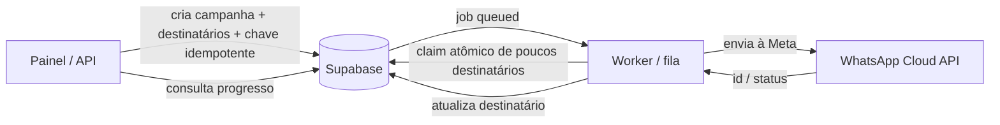

# Plano de correção — auditoria operacional e segurança

Data: 23/07/2026  
Escopo: broadcast, proteção de páginas, SSRF de webhooks e saúde da CI.

## Ordem de execução

| Prioridade | Item | Por que vem agora |
| --- | --- | --- |
| P0 | RBAC do WhatsApp | Já foi tratado no código; ações em Meta não podem depender apenas de RLS. |
| P1 | Broadcast durável | Evita timeout, reenvio e falta de rastreabilidade em campanhas grandes. |
| P2 | SSRF de webhooks | Fecha destinos de rede especiais que ainda passam pela validação. |
| P2 | Proteção de páginas | Uniformiza a fronteira de autenticação no servidor. |
| P2 | Exclusão/arquivamento de conversas | Hoje não há produto/rota para a ação, mas o banco autoriza o `DELETE` direto para agentes. |
| P3 | Testes e lint | Volta a tornar a CI uma fonte confiável de regressões. |

> Este documento descreve a correção. Ele não aplica migrations nem altera o banco de produção.

---

## 1. Broadcast com fila persistente — alto

### O que foi encontrado

O envio iniciado pelo painel ainda acontece no navegador. O hook cria o broadcast e seus destinatários, separa a lista em lotes e faz `fetch('/api/whatsapp/broadcast')` para cada lote. A rota HTTP então percorre cada destinatário sequencialmente e só responde após terminar o lote.

Há também uma API pública que já grava `broadcasts` e `broadcast_recipients` antes de responder. Porém ela usa `after()` para disparar o mesmo loop sequencial e declara `maxDuration = 60`; portanto, ela melhora a resposta inicial, mas não é uma fila durável. Uma interrupção da instância ainda pode deixar destinatários em `pending` e a campanha em `sending`.

### Onde localizar

| Local | Papel atual |
| --- | --- |
| `src/hooks/use-broadcast-sending.ts` | Fluxo do painel: cria registros e mantém o navegador enviando lote a lote. O loop de envio está próximo do `fetch('/api/whatsapp/broadcast')`. |
| `src/app/api/whatsapp/broadcast/route.ts` | Rota legada do painel; faz `for (const recipient of recipients)` e espera cada chamada à Meta. |
| `src/lib/whatsapp/broadcast-core.ts` | Base útil para a nova implementação: já persiste destinatários e atualiza o status individual. O `deliverBroadcast()` ainda é sequencial. |
| `src/app/api/v1/broadcasts/route.ts` | API que responde `202`, mas agenda o envio por `after()`, limitado a 60 segundos. |
| `supabase/migrations/001_initial_schema.sql` | Estruturas iniciais `broadcasts` e `broadcast_recipients`. |
| `supabase/migrations/003_broadcast_recipient_wamid.sql` | Correlação por `whatsapp_message_id` e agregados de contagem. |
| `supabase/migrations/005_broadcast_counts_incremental.sql` | Trigger incremental dos contadores. |

Para reencontrar rapidamente:

```sh
rg -n "api/whatsapp/broadcast|deliverBroadcast|for \(const recipient|broadcast_recipients" src
```

### Correção proposta

Trocar o envio em requisição por uma fila persistida no banco e um worker independente:



1. A rota de criação deve executar apenas uma transação curta: validar a audiência, criar `broadcasts`, inserir `broadcast_recipients`, registrar o job como `queued` e retornar `202` com o ID da campanha.
2. O frontend não deve fazer o envio nem depender de permanecer aberto. Ele apenas consulta ou assina o progresso da campanha.
3. Um worker (fila gerenciada, processo dedicado, Edge Function acionada por cron, ou outro executor persistente) deve buscar poucos destinatários por vez usando um claim atômico. Em PostgreSQL, a ideia é usar bloqueio de linha com `FOR UPDATE SKIP LOCKED` ou RPC equivalente, uma lease com prazo e lotes pequenos.
4. Antes de chamar a Meta, o worker registra a tentativa; depois, grava `sent`, `failed` ou `unknown`. Nunca deve reenviar automaticamente uma tentativa `unknown`: se a conexão cair depois de a Meta aceitar a mensagem, reenviar pode duplicá-la. A reconciliação deve consultar o webhook/status quando disponível ou exigir ação explícita do operador.
5. A criação precisa aceitar uma chave de idempotência estável por intenção do usuário (por exemplo, `Idempotency-Key`). Ela deve ter índice único por conta. Repetir a mesma requisição deve devolver a campanha já criada, não criar outra.
6. Cada `broadcast_recipients` deve ter uma identidade única por campanha e contato. Adicionar uma restrição única evita que o mesmo contato entre duas vezes na mesma campanha.
7. O worker deve retomar leases vencidas, limitar concorrência/rate limit por WABA e permitir pausar/cancelar uma campanha sem apagar o histórico.

### Migration necessária

Sim. Criar uma migration nova, após decidir o executor da fila, contendo no mínimo:

- tabela de jobs ou colunas de job/lease na campanha (`queued`, `running`, `paused`, `completed`, `failed`, `cancelled`);
- chave idempotente de criação com unicidade por `account_id`;
- colunas de tentativa no destinatário (`attempt_count`, `claimed_at`, `lease_expires_at`, `last_attempt_at`, `last_error` e estado `unknown` quando necessário);
- `UNIQUE (broadcast_id, contact_id)`;
- índices para busca do worker, por exemplo estado + lease e destinatários pendentes por campanha;
- RLS explícita para as tabelas expostas. O worker deve usar uma credencial de servidor; não conceder ao cliente permissão para dar claim ou alterar tentativas.

Ao criar qualquer tabela `public` nova, revisar também a exposição na Data API e os `GRANT`s. O comportamento de exposição automática de tabelas mudou no Supabase; RLS sozinha não substitui essa revisão.

### Critérios de aceite e testes

- Uma campanha de 5.000 contatos retorna `202` rapidamente e continua mesmo com o navegador fechado.
- Reiniciar o worker durante a campanha não perde destinatários; leases vencidas são retomadas.
- Repetir a mesma criação com a mesma chave não cria uma segunda campanha.
- Um contato aparece no máximo uma vez por campanha.
- Há testes para claim concorrente, lease vencida, falha antes/depois da chamada à Meta, pausa/cancelamento e retomada.
- A tela de detalhes em `src/app/(dashboard)/broadcasts/[id]/page.tsx` mostra pendentes, enviados, falhos e desconhecidos sem inferir sucesso apenas pelo término da requisição.

---

## 2. Proteção de páginas no middleware — médio

### O que foi encontrado

`/flows` e `/notifications` existem no dashboard, mas não constam no array `protectedPaths` do middleware. Sem sessão, o HTML/estrutura da rota pode ser entregue e o redirecionamento fica a cargo do JavaScript do cliente. Hoje isso não parece expor dados diretamente, mas deixa a proteção inconsistente e é uma armadilha para futuras páginas com renderização no servidor.

### Onde localizar

| Local | Papel atual |
| --- | --- |
| `src/middleware.ts` | Define `protectedPaths`; faltam `/flows` e `/notifications`. |
| `src/app/(dashboard)/flows/` | Páginas de fluxos a testar após a alteração. |
| `src/app/(dashboard)/notifications/page.tsx` | Página de notificações a testar após a alteração. |
| `src/middleware.test.ts` | Testes de redirects e de preservação de cookies renovados. |

```sh
rg -n "protectedPaths|/flows|/notifications" src/middleware.ts src/middleware.test.ts src/app
```

### Correção proposta

1. Incluir `/flows` e `/notifications` em `protectedPaths` em `src/middleware.ts`.
2. Preferir uma fonte única para essas rotas (por exemplo, uma constante exportada e testada) para não esquecer páginas do dashboard no futuro.
3. Adicionar testes para visitante sem sessão em `/flows` e `/notifications`: resposta `307`, destino `/login` e preservação dos cookies atualizados, igual aos cenários já cobertos para `/dashboard`.
4. Testar um usuário autenticado nas duas URLs para confirmar que não houve regressão.

### Migration necessária

Não.

### Critérios de aceite

- Sem sessão: `GET /flows` e `GET /notifications` recebem redirect no middleware, antes de renderizar a página.
- Com sessão: ambas passam normalmente.
- `src/middleware.test.ts` cobre os quatro casos.

---

## 3. SSRF em webhooks externos — médio

### O que foi encontrado

O app valida que o webhook usa HTTPS no cadastro e, no momento de entregar o evento, resolve o DNS e rejeita vários endereços privados. A proteção atual é uma boa primeira barreira, mas `isPrivateOrReservedIp()` ainda permite blocos que não são endereços globais utilizáveis, como faixas de documentação, benchmarking, multicast e parte do espaço reservado. Além disso, o próprio comentário do código reconhece que a resolução DNS e o `fetch()` posterior não eliminam DNS rebinding.

### Onde localizar

| Local | Papel atual |
| --- | --- |
| `src/lib/webhooks/ssrf.ts` | Classificação atual de IP e resolução DNS. |
| `src/lib/webhooks/deliver.ts` | Chama `isDeliverableUrl()` antes do `fetch`; já usa `redirect: 'manual'` e timeout. |
| `src/lib/webhooks/endpoints.ts` | Só aceita URL HTTPS no cadastro. |
| `src/app/api/v1/webhooks/route.ts` | Cria endpoints; validação de rede ainda não acontece nessa etapa. |
| `src/app/api/v1/webhooks/[id]/route.ts` | Atualiza URL do endpoint. |
| `src/lib/webhooks/ssrf.test.ts` | Testes atuais do bloqueio. |

```sh
rg -n "isPrivateOrReservedIp|isDeliverableUrl|normalizeWebhookUrl|redirect: 'manual'" src/lib/webhooks src/app/api/v1/webhooks
```

### Correção proposta

1. Trocar a classificação manual por uma política de **allowlist de endereços globalmente roteáveis**, usando uma biblioteca/IP parser bem testado ou uma implementação completa baseada em intervalos CIDR. Não manter uma denylist parcial de casos conhecidos.
2. Rejeitar, no mínimo, IPv4 `0.0.0.0/8`, RFC1918, loopback, link-local/metadata, CGNAT, `192.0.0.0/24`, TEST-NET (`192.0.2.0/24`, `198.51.100.0/24`, `203.0.113.0/24`), benchmarking (`198.18.0.0/15`), multicast (`224.0.0.0/4`) e reservado (`240.0.0.0/4`); fazer o equivalente para IPv6 não global (unspecified, loopback, link-local, ULA, mapped/embedded IPv4 e outros prefixos especiais).
3. Validar a URL no cadastro e na alteração para feedback imediato. Revalidar novamente no envio, pois DNS pode mudar depois do cadastro.
4. Manter `redirect: 'manual'`, timeout curto e limite de tamanho de resposta. Não seguir redirects para uma segunda URL.
5. Tratar DNS rebinding como risco de infraestrutura: a defesa completa exige saída de rede que bloqueie destinos privados/metadata ou um proxy de egress que conecte ao IP validado. Resolver DNS e depois fazer `fetch(hostname)` não fixa o socket no IP validado.
6. Revisar endpoints já salvos: revalidar todos, desativar os não conformes e registrar o motivo em auditoria.

### Migration necessária

Não é obrigatória para o bloqueio. Pode ser útil uma migration apenas se for necessário guardar motivo/data da desativação ou uma trilha de auditoria de validação.

### Critérios de aceite

- Testes de unidade cobrem cada faixa negada e IPs públicos permitidos, tanto IPv4 como IPv6.
- Testes simulam hostname com múltiplos A/AAAA; se qualquer resultado não for global, a entrega é recusada.
- Cadastro e `PATCH` retornam `400` para URL não entregável; entrega revalida antes do `fetch`.
- Um teste confirma que redirect `3xx` não é seguido.

---

## 4. Testes e lint — qualidade/CI

### Estado observado

Em 23/07/2026, `npm test` executou 683 testes: 681 passaram e 2 falharam em `src/lib/dashboard/date-utils.test.ts`. As falhas usam `new Date('2026-05-18')`; uma data ISO sem horário é interpretada como UTC, então pode cair no domingo no fuso local.

Também foi executado `npm run lint`: há 7 erros e 31 avisos. Os erros mais relevantes estão em callbacks memoizados com dependências incompletas (`contacts`, `pipelines` e `join`), `setState` síncrono em effect (`settings`) e um `let` que deve ser `const` em `use-auth`.

### Onde localizar

| Local | Problema |
| --- | --- |
| `src/lib/dashboard/date-utils.ts` | Funções usam o horário local por decisão de produto. |
| `src/lib/dashboard/date-utils.test.ts` | Datas ISO sem hora causam testes dependentes de fuso. |
| `src/app/(dashboard)/contacts/page.tsx` | Erro do React Compiler: dependência `t` ausente em memoização. |
| `src/app/(dashboard)/pipelines/page.tsx` | Mesmo tipo de erro em callback de mover negócio. |
| `src/app/(dashboard)/settings/page.tsx` | `setState` síncrono dentro de effect. |
| `src/app/join/[token]/page.tsx` | Callbacks memoizados com dependências incompletas. |
| `src/hooks/use-auth.tsx` | `let` que não é reatribuído. |
| `src/app/(dashboard)/broadcasts/*` e demais avisos do lint | Dependências de hook e imports não usados. |

```sh
npm test
npm run lint
rg -n "new Date\(\"20|exhaustive-deps|useCallback\(" src/lib/dashboard src/app src/components src/hooks
```

### Correção proposta

1. Em testes cujo objetivo é “segunda-feira no calendário local”, usar `new Date(2026, 4, 18)` em vez de string ISO somente com data. Para casos UTC, escrever o horário e a expectativa explicitamente.
2. Rodar os testes de data em pelo menos dois fusos no CI, por exemplo UTC e `America/Fortaleza`. Isso protege a semântica local declarada em `date-utils.ts`.
3. Corrigir os erros do React Compiler antes dos avisos cosméticos: incluir dependências reais (`t`, callbacks estáveis) ou reestruturar o callback/effect para que a memoização tenha dependências corretas.
4. Remover `eslint-disable` que já não é necessário e imports mortos. Não silenciar `react-hooks/exhaustive-deps` para “deixar verde”; cada supressão deve ter justificativa técnica curta e teste de comportamento.
5. Fazer a CI falhar em lint e testes. Depois de zerar o passivo, manter `npm run typecheck`, `npm run lint` e `npm test` como checks obrigatórios de pull request.

### Migration necessária

Não.

### Critérios de aceite

- `npm test` passa em todos os fusos definidos pela matriz de CI.
- `npm run lint` termina sem erros; avisos restantes são triados e documentados ou eliminados.
- `npm run typecheck` passa.
- Um PR com hook dependency quebrada ou teste dependente de fuso falha na CI.

---

## 5. Exclusão ou arquivamento de conversa — produto e governança

### O que foi encontrado

A interface do Inbox não oferece exclusão de conversa. Na imagem do Inbox, e no componente correspondente, o menu da conversa permite alterar o estado (`Open`, `Pending` ou `Closed`) e as ações nas mensagens são reagir, responder e copiar; não há ícone, confirmação ou fluxo de lixeira.

Também não existe rota de aplicação nem endpoint público que aceite `DELETE` para `conversations`: a API pública expõe apenas leitura de conversas. Portanto, não há exclusão suportada de ponta a ponta no produto.

Há, porém, uma inconsistência importante: a policy `conversations_delete` autoriza um membro com papel `agent` a executar `DELETE` diretamente na tabela via Data API, mesmo sem existir botão ou rota oficial. Apagar uma conversa desse modo pode cascatar suas mensagens e reações, além de remover registros que sustentam o histórico operacional.

### Onde localizar

| Local | Papel atual |
| --- | --- |
| `src/components/inbox/message-thread.tsx` | Cabeçalho da conversa e menu de estados; não há ação de excluir/arquivar. |
| `src/components/inbox/conversation-list.tsx` | Lista e filtros de conversas; não há lixeira. |
| `src/app/api/v1/conversations/route.ts` | API pública lista conversas; não há `DELETE`. |
| `src/app/api/v1/conversations/[id]/route.ts` | API pública busca uma conversa; implementa apenas `GET`. |
| `supabase/migrations/017_account_sharing.sql` | Cria `conversations_delete` para `agent`; é a autorização de delete hoje. |
| `supabase/migrations/001_initial_schema.sql` | `messages.conversation_id` usa `ON DELETE CASCADE`. |
| `supabase/migrations/009_message_actions.sql` | Reações dependem de mensagens com `ON DELETE CASCADE`. |

```sh
rg -n "conversations_delete|DELETE FROM conversations|from\(.*conversations.*delete|Trash2" src supabase/migrations
```

### Decisão de produto necessária

“Excluir” pode significar três coisas diferentes e elas não devem ser implementadas como se fossem iguais:

1. **Arquivar para toda a equipe (recomendado):** tira a conversa da lista padrão, preserva mensagens, status, auditoria e possibilidade de restaurar.
2. **Ocultar apenas para um usuário:** não altera a conversa para os colegas; exige uma tabela de preferências/visibilidade por usuário.
3. **Apagar os dados do CRM:** remove o histórico local e seus relacionamentos. Isso é irreversível e não deve prometer apagar a cópia já existente no WhatsApp do cliente ou da empresa.

### Correção proposta

1. Enquanto a decisão não estiver pronta, remover a policy `conversations_delete` para impedir a exclusão direta via Data API. Um botão ausente não é um controle de acesso.
2. Implementar primeiro **arquivamento**: adicionar `archived_at`, `archived_by` e, se necessário, `archive_reason`; filtrar arquivadas da listagem padrão e oferecer “Arquivadas” + “Restaurar”.
3. Colocar a ação em uma rota server-side autenticada, com escopo de conta e papel explícito. Para arquivar, `agent` pode ser suficiente; para eliminação definitiva, exigir `admin` ou `owner` e uma confirmação com texto claro sobre a irreversibilidade.
4. Registrar evento de auditoria com quem executou a ação, quando e o motivo. Não usar `DELETE` físico para o fluxo comum.
5. Se for exigida eliminação definitiva por retenção/LGPD, criar um fluxo separado, com autorização elevada, auditoria e revisão das chaves estrangeiras/cascades antes da execução.

### Migration necessária

Sim, para a opção recomendada de arquivamento e para corrigir RLS:

- remover a policy `conversations_delete` atual;
- adicionar as colunas de arquivamento ou uma tabela de visibilidade por usuário, conforme a decisão acima;
- criar índices para a listagem por `account_id` e `archived_at`;
- criar policies separadas para leitura, atualização/arquivamento e, apenas se aprovado, exclusão definitiva;
- manter RLS e revisar a exposição pela Data API antes de dar permissões a novas tabelas.

### Critérios de aceite

- Um `agent` não consegue remover conversa por chamada direta à Data API.
- Arquivar não remove mensagens, reações nem métricas; restaurar devolve a conversa à lista.
- A lista padrão não mostra arquivadas, mas a busca de arquivadas funciona para usuários autorizados.
- Ação tem confirmação, feedback de erro/sucesso e teste de autorização entre contas.
- Não existe promessa de “apagar para todos no WhatsApp” quando a operação é somente local ao CRM.

---

## Sequência sugerida de entregas

1. Corrigir middleware e adicionar seus testes (pequeno, baixo risco).
2. Endurecer SSRF e seus testes, incluindo revalidação dos endpoints existentes.
3. Definir e implementar o comportamento de arquivamento/exclusão de conversa, incluindo a correção de RLS.
4. Desenhar e aprovar a infraestrutura do worker de broadcast; só então criar a migration e mover o fluxo do painel.
5. Corrigir os 2 testes de timezone e os 7 erros de lint; depois tratar avisos por área funcional.

Para o broadcast, a decisão de infraestrutura é obrigatória antes da implementação: uma função `after()` ou um loop dentro da rota não oferece durabilidade suficiente para campanhas grandes.
