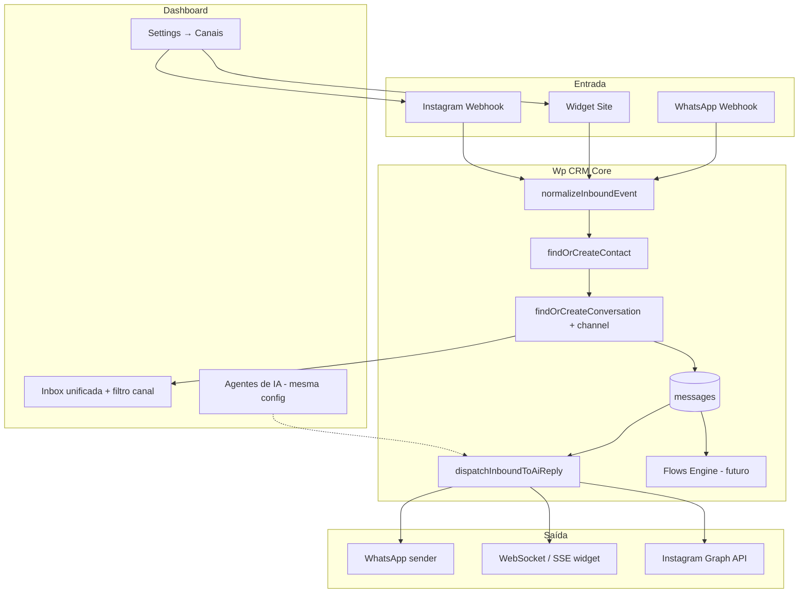

# Canais omnichannel — Site + Instagram + Caixa de entrada unificada

> **Projeto:** fork Wp CRM (`aqueleroni/wacrm`)  
> **Data:** 2026-07-04  
> **Status:** plano / ideação — **não implementado**  
> **Relacionado:** `docs/ai-agent-evolution-plan.md` (agente de IA já roda no WhatsApp; estender para novos canais)

---

## 1. Resumo executivo

| Hoje | Meta |
|------|------|
| Um canal: **WhatsApp** (Meta Cloud API) | **Caixa de entrada unificada** com filtros por canal |
| 1 conversa por `(conta, contato)` — identidade = telefone | 1 conversa por `(conta, contato, canal)` |
| Configuração só em **Settings → WhatsApp** | **Settings → Canais**: WhatsApp, Site, Instagram |
| Agente IA só no webhook WhatsApp | Mesmo agente (persona + KB + memória + CRM) em **todos os canais ativos** |
| Inbox sem origem visível | Badge/filtro **WhatsApp · Site · Instagram** em cada thread |

**Proposta em uma frase:** o cliente cadastra o site e conecta o Instagram; visitantes e seguidores mandam mensagem; tudo cai na **mesma inbox**, com campo/filtro de canal; o **mesmo agente de IA** da conta responde onde estiver habilitado.

Implementação sugerida em **8 fases** incrementais. Cada fase entrega valor isolado e não quebra o WhatsApp existente.

---

## 2. Visão de produto

### 2.1 Personas

| Quem | O que quer |
|------|------------|
| **Admin da conta (cliente Wepost)** | Cadastrar domínio do site, colar um snippet, ligar Instagram Business, ver tudo num lugar |
| **Visitante do site** | Balão de chat no canto; resposta rápida; opcionalmente deixar nome/e-mail |
| **Seguidor no Instagram** | DM tratada como conversa normal — handoff para humano quando precisar |
| **Agente humano (equipe)** | Inbox com filtro por canal; sabe de onde veio; CRM do contato unificado |
| **Wp CRM / Wepost (nós)** | Oferecer widget + agente como produto; mesma stack de IA por conta |

### 2.2 User stories (MVP)

1. **Como admin**, quero cadastrar meu site (`https://cliente.com.br`) e copiar um script de embed, para o chat aparecer no meu site.
2. **Como visitante**, quero enviar uma mensagem no widget e receber resposta (bot ou humano).
3. **Como agente**, quero ver na inbox conversas do **Site** separadas das do **WhatsApp**, com ícone claro.
4. **Como admin**, quero conectar minha conta **Instagram Business** (via Meta) e receber DMs na inbox.
5. **Como admin**, quero ligar/desligar **auto-resposta do agente de IA** por canal (ex.: IA no site, humano no IG até validar).
6. **Como agente**, quero que contatos do site (e-mail/nome) e do IG (@handle) apareçam no **mesmo cartão de contato** quando forem a mesma pessoa (mesclagem manual v1; automática v2).

### 2.3 O que **não** entra no MVP

- Instagram **Comments** (só DM na v1)
- Chat ao vivo com vídeo
- Widget white-label avançado (temas por página) — v1 usa cores da conta (`brand_primary_color`)
- Mesclagem automática cross-channel (telefone = e-mail = @instagram) — manual ou heurística simples depois
- Cobrança por canal / limites de mensagens — documentar ganchos, implementar depois

---

## 3. Auditoria do sistema atual

### 3.1 Modelo de dados (relevante)

```
contacts          phone NOT NULL (identidade principal hoje)
conversations     UNIQUE implícito (account_id + contact_id) — 1 thread por contato
messages          sender_type: customer | agent | bot
whatsapp_config   1 row / account — token Meta, phone_number_id
ai_configs        1 row / account — persona, auto_reply_enabled (global hoje)
```

**Limitações para omnichannel:**

| Gap | Impacto |
|-----|---------|
| Sem coluna `channel` em `conversations` | Impossível ter WhatsApp + Site do mesmo contato como threads distintas |
| Contato exige `phone` | Visitante web sem telefone não cabe no modelo |
| `dispatchInboundToAiReply` acoplado ao webhook WhatsApp + `engineSendText` | Novos canais precisam de **dispatcher + sender** por canal |
| Inbox filtra status/tags, não canal | UX não distingue origem |
| Settings só tem aba WhatsApp | Falta UI de cadastro Site / Instagram |

### 3.2 Fluxo WhatsApp (referência a replicar)

```
Meta webhook → findOrCreateContact(phone) → findOrCreateConversation
            → insert message → flows? → dispatchInboundToAiReply → engineSendText
```

Novos canais devem convergir no **mesmo ponto** após normalizar o inbound:

```
Inbound (qualquer canal) → normalizeInboundEvent()
                        → findOrCreateContact(channelIdentity)
                        → findOrCreateConversation(account, contact, channel)
                        → insert message
                        → flows? (fase posterior)
                        → dispatchInboundToAiReply (se canal permitir bot)
                        → channelSender.sendText(...)
```

### 3.3 Agente de IA (já pronto para estender)

O runtime em `src/lib/ai/` já monta prompt com:

- Persona + exemplos de conversa  
- KB + memória + skills  
- Contexto CRM (`buildCrmContext`)  
- Histórico da conversa  

**Falta apenas:** (1) invocar de webhooks/widget/IG; (2) enviar resposta pelo **sender correto**; (3) flags por canal em `ai_configs` ou tabela de canal.

---

## 4. Arquitetura alvo

### 4.1 Diagrama



### 4.2 Princípios de design

1. **Canal explícito** — toda conversa e toda mensagem outbound sabe de onde veio (`channel`).
2. **Contato flexível** — identidade primária por canal (`phone`, `visitor_id`, `instagram_user_id`); telefone deixa de ser obrigatório globalmente.
3. **Config por canal** — credenciais e toggles (ativo, IA, horário) separados; persona/KB **compartilhados** por conta.
4. **Sender plugável** — mesma interface `sendText(conversation, text)` com implementações WhatsApp / Web / Instagram.
5. **Não quebrar WhatsApp** — migration aditiva; conversas existentes viram `channel = 'whatsapp'`.

---

## 5. Modelo de dados (proposta)

### 5.1 Migration `035_omnichannel_foundation.sql` (fase 1)

**Enum / check `channel`**

```sql
-- Valores: 'whatsapp' | 'webchat' | 'instagram'
ALTER TABLE conversations ADD COLUMN channel TEXT NOT NULL DEFAULT 'whatsapp';
ALTER TABLE messages ADD COLUMN channel TEXT; -- denormalizado opcional p/ analytics

-- Trocar unicidade: 1 thread por (account, contact, channel)
CREATE UNIQUE INDEX conversations_account_contact_channel_key
  ON conversations (account_id, contact_id, channel);
```

**Contatos — identidades externas**

```sql
ALTER TABLE contacts ALTER COLUMN phone DROP NOT NULL;

ALTER TABLE contacts ADD COLUMN source_channel TEXT; -- primeiro canal que criou
ALTER TABLE contacts ADD COLUMN instagram_user_id TEXT;
ALTER TABLE contacts ADD COLUMN instagram_username TEXT;
ALTER TABLE contacts ADD COLUMN webchat_visitor_id TEXT;

CREATE UNIQUE INDEX contacts_account_instagram_user
  ON contacts (account_id, instagram_user_id)
  WHERE instagram_user_id IS NOT NULL;

CREATE UNIQUE INDEX contacts_account_webchat_visitor
  ON contacts (account_id, webchat_visitor_id)
  WHERE webchat_visitor_id IS NOT NULL;
```

> Telefone continua único por conta onde preenchido (índice parcial existente / migration 022).

### 5.2 Tabela `channel_configs` (1 row por canal ativo / account)

| Coluna | WhatsApp | Webchat | Instagram |
|--------|----------|---------|-----------|
| `channel` | `whatsapp` | `webchat` | `instagram` |
| `is_enabled` | ✓ | ✓ | ✓ |
| `auto_reply_enabled` | ✓ (hoje global) | ✓ | ✓ |
| `config_json` | migrar de `whatsapp_config` ou view | `domains[]`, `widget_color`, `welcome_message`, `offline_message` | `page_id`, `instagram_account_id`, tokens criptografados |
| `public_key` | — | UUID público no embed | — |

**Alternativa v1 mais simples:** manter `whatsapp_config` e criar `webchat_configs` + `instagram_configs` separadas (menos refactor, mais duplicação). **Recomendação:** tabela unificada `channel_configs` na fase 3; até lá, tabelas dedicadas por canal.

### 5.3 Sessões do widget (webchat)

```sql
CREATE TABLE webchat_sessions (
  id UUID PRIMARY KEY,
  account_id UUID NOT NULL,
  visitor_id TEXT NOT NULL,        -- cookie/localStorage no browser
  contact_id UUID REFERENCES contacts(id),
  conversation_id UUID REFERENCES conversations(id),
  page_url TEXT,
  user_agent TEXT,
  last_seen_at TIMESTAMPTZ,
  created_at TIMESTAMPTZ DEFAULT NOW()
);
```

Visitante anônimo → `visitor_id` estável → contato + conversa `webchat` → se informar e-mail, atualiza contato.

---

## 6. Canal Site (Webchat + Widget)

### 6.1 Cadastro e configuração (Settings)

Nova seção **Settings → Canais → Site**:

| Campo | Descrição |
|-------|-----------|
| Domínios permitidos | `cliente.com.br`, `www.cliente.com.br` (CORS + validação embed) |
| Mensagem de boas-vindas | Primeira mensagem automática (bot ou sistema) |
| Cor do widget | Default: `brand_primary_color` da conta |
| Posição | canto inferior direito/esquerdo |
| Coletar e-mail | off / opcional / obrigatório antes de enviar |
| Auto-resposta IA | toggle (usa `ai_configs` + persona Gabriella) |
| Horário comercial | opcional — fora do horário: mensagem offline + fila |

**Snippet de embed** (gerado após salvar):

```html
<script
  src="https://app.wpcrm.com.br/widget.js"
  data-site-key="wk_live_xxxxxxxx"
  async
></script>
```

### 6.2 Widget (client-side)

- Bundle leve (`public/widget/` ou rota `/embed/widget.js`)
- Gera/recupera `visitor_id` em `localStorage`
- UI: balão + painel de chat (React mount ou vanilla para peso mínimo)
- Transporte v1: **long-poll** ou **SSE** (`GET /api/channels/webchat/stream`); v2: WebSocket Supabase Realtime com token efêmero
- POST mensagem: `POST /api/channels/webchat/messages` com `site_key` + `visitor_id` + texto
- Rate limit por IP + site_key

### 6.3 APIs (backend)

| Rota | Auth | Função |
|------|------|--------|
| `GET/POST /api/channels/webchat/config` | session admin | CRUD config + gerar site_key |
| `POST /api/channels/webchat/messages` | site_key + visitor_id | Inbound visitante |
| `GET /api/channels/webchat/messages` | site_key + visitor_id | Poll histórico |
| `GET /api/channels/webchat/stream` | site_key + visitor_id | SSE novas mensagens |
| `POST /api/channels/webchat/identify` | site_key + visitor_id | Nome/e-mail opcional |

**Segurança:** validar `Origin`/`Referer` contra domínios cadastrados; site_key só identifica a conta (não é secret absoluto — domínio é a barreira principal).

### 6.4 Agente no site

Mesmo pipeline:

```
POST mensagem visitante
  → buildCrmContext(contact_id)
  → buildAgentContext(...)
  → generateReply
  → insert message (sender_type: bot)
  → push SSE para widget
```

Handoff `[[HANDOFF]]`: desliga auto-reply na conversa + notifica equipe (notificação existente).

---

## 7. Canal Instagram (DM)

### 7.1 Pré-requisitos Meta

- Conta **Instagram Professional** (Business ou Creator)
- Vinculada a uma **Facebook Page**
- App Meta com produtos: **Instagram Messaging**, **Webhooks**
- Permissões: `instagram_manage_messages`, `pages_manage_metadata`, etc.
- Revisão de app Meta para produção (dev mode: testers)

### 7.2 Cadastro (Settings)

Nova seção **Settings → Canais → Instagram**:

1. Botão **Conectar com Meta** (OAuth — reutilizar padrão do fluxo WhatsApp se existir, ou Embedded Signup)
2. Selecionar Page + Instagram account
3. Webhook URL: `https://app.../api/channels/instagram/webhook`
4. Toggles: canal ativo, auto-resposta IA, mensagem fora de janela (quando aplicável)

**Armazenar (criptografado):** page access token, instagram account id, webhook verify token.

### 7.3 Webhook Instagram

Espelhar `src/app/api/whatsapp/webhook/route.ts`:

```
GET  → challenge verification
POST → messaging events
  → extrair sender IGSID + username (se disponível)
  → findOrCreateContact(instagram_user_id)
  → findOrCreateConversation(..., channel: 'instagram')
  → insert message (texto, imagem, story reply — v1 texto)
  → dispatchInboundToAiReply (se elegível)
  → send via Graph API POST /{ig-user-id}/messages
```

**Janela de mensagens:** Instagram exige tag human_agent fora da janela 24h/7d — documentar na UI; IA auto-reply só dentro da janela na v1.

### 7.4 Contato Instagram

- `instagram_user_id` (IGSID) — chave estável  
- `instagram_username` — display, atualizável  
- `phone` — null até agente pedir e cliente informar (não via API Meta na v1)  
- Avatar: URL do perfil se API permitir  

---

## 8. Caixa de entrada unificada

### 8.1 Filtro por canal

Na barra de filtros existente (`conversation-list.tsx`), adicionar:

```
[Todos] [WhatsApp] [Site] [Instagram]  |  [Abertas] [Não lidas] ...
```

- Query: `conversations.channel = $1` quando filtro ativo  
- Contadores opcionais por canal (badge numérico)

### 8.2 Lista de conversas

Cada item mostra:

- Ícone do canal (WhatsApp verde, globo Site, Instagram gradiente)  
- Nome do contato (ou "Visitante" / @username)  
- Preview última mensagem  
- Tag `channel` visível no mobile  

### 8.3 Composer (thread aberta)

| Canal | Comportamento |
|-------|---------------|
| WhatsApp | Igual hoje — templates, mídia, janela 24h |
| Site | Texto + anexo futuro; sem template Meta |
| Instagram | Texto v1; mídia fase 2; aviso de janela |

Desabilitar ações incompatíveis (ex.: botão "Template WhatsApp" escondido em thread Instagram).

### 8.4 Sidebar do contato

Mostrar **Identidades vinculadas**:

```
Telefone: +55 11 ...
Instagram: @cliente
E-mail: (do widget)
Origem: Site · primeiro contato 04/07/2026
```

Link futuro: "Mesclar com outro contato".

---

## 9. Agente de IA por canal

### 9.1 Config (estender `ai_configs` ou `channel_configs`)

```sql
ALTER TABLE ai_configs ADD COLUMN auto_reply_channels JSONB DEFAULT '["whatsapp"]';
-- ou colunas: auto_reply_webchat, auto_reply_instagram
```

UI em **Agentes → Configuração → Canais**:

- ☑ WhatsApp  
- ☑ Site  
- ☐ Instagram (desligado até validar)  

Persona, KB, memória e skills **continuam únicos por conta** — o tom da Gabriella é o mesmo; opcionalmente `conversation_examples` ganha exemplos por canal depois.

### 9.2 Ajustes de prompt por canal (fase 5)

Injetar hint curto no system prompt:

| Canal | Hint |
|-------|------|
| `webchat` | "Cliente está no site {domain}. Respostas curtas; pode sugerir falar no WhatsApp." |
| `instagram` | "Tom leve; sem links longos; emoji com moderação." |
| `whatsapp` | (atual) |

---

## 10. Plano de implementação por fases

### Fase 0 — Alinhamento (0,5 dia)

- [ ] Validar escopo MVP com stakeholders (Site + IG DM; sem comments)
- [ ] Decidir: SSE vs WebSocket widget; tabela única `channel_configs` vs tabelas separadas
- [ ] Conta Meta dev + Instagram teste
- [ ] Definir domínio do widget em produção (`widget.js` CDN ou same-origin)

**Entregável:** este doc aprovado + issues/tickets por fase.

---

### Fase 1 — Fundação de dados (2–3 dias)

**Objetivo:** modelo suporta canal sem quebrar WhatsApp.

- [ ] Migration `035`: `conversations.channel`, índice único `(account_id, contact_id, channel)`
- [ ] Backfill conversas existentes → `whatsapp`
- [ ] `contacts.phone` nullable + colunas IG / webchat visitor
- [ ] Types TS + `CONVERSATION_SELECT` inclui `channel`
- [ ] Testes de unicidade e migração

**Aceite:** WhatsApp continua idêntico; banco aceita canal explícito.

---

### Fase 2 — Inbox: filtro e badge de canal (2 dias)

**Objetivo:** operador vê de onde veio a conversa.

- [ ] Filtro Todos / WhatsApp / Site / Instagram na lista
- [ ] Ícone/badge por thread
- [ ] i18n PT-BR + EN
- [ ] Deep link `?channel=webchat` opcional

**Aceite:** UI pronta; só WhatsApp tem dados reais até fases 3–4.

---

### Fase 3 — Canal Site: config + APIs (4–5 dias)

**Objetivo:** admin cadastra site; APIs recebem mensagem.

- [ ] `webchat_configs` (ou row em `channel_configs`)
- [ ] Settings → Canais → Site (`webchat-config.tsx`)
- [ ] Gerar `site_key`, domínios, toggles
- [ ] APIs inbound + poll/SSE
- [ ] `findOrCreateContact` por `visitor_id`
- [ ] Conversa `channel = 'webchat'`
- [ ] Realtime inbox (reuse `use-realtime`)

**Aceite:** mensagem via API (curl/Postman) aparece na inbox filtrada como Site.

---

### Fase 4 — Widget embed (3–4 dias)

**Objetivo:** chat visível no site do cliente.

- [ ] `widget.js` + UI balão
- [ ] Snippet copiável na Settings
- [ ] CORS + validação domínio
- [ ] Rate limit
- [ ] Mensagem de boas-vindas
- [ ] Identificação opcional (nome/e-mail)

**Aceite:** site de teste com embed troca mensagens com a inbox.

---

### Fase 5 — Agente IA no Site (2 dias)

**Objetivo:** Gabriella responde no widget.

- [ ] Refatorar `dispatchInboundToAiReply` → aceitar `channel` + `ChannelSender`
- [ ] `WebchatSender` (persiste + SSE)
- [ ] Toggle auto-reply Site em Agentes
- [ ] Handoff desliga bot na conversa

**Aceite:** visitante pergunta preço → bot responde ou handoff; equipe vê na inbox.

---

### Fase 6 — Instagram: OAuth + webhook (5–7 dias)

**Objetivo:** DMs entram na inbox.

- [ ] Settings → Canais → Instagram
- [ ] OAuth Meta + salvar tokens criptografados
- [ ] Webhook verify + receive
- [ ] Contato por IGSID
- [ ] Conversa `channel = 'instagram'`
- [ ] Envio outbound Graph API
- [ ] Tratamento básico de mídia (opcional v1.1)

**Aceite:** DM de teste aparece na inbox; agente humano responde pelo dashboard.

---

### Fase 7 — Agente IA no Instagram (2 dias)

**Objetivo:** auto-reply IG com guardrails de janela.

- [ ] `InstagramSender`
- [ ] Gate: só auto-reply dentro da messaging window
- [ ] Toggle por canal
- [ ] Hint de prompt `instagram`

**Aceite:** bot responde DM simples; fora da janela, UI avisa operador.

---

### Fase 8 — Polimento + API pública (3–4 dias)

- [ ] Public API v1: `channel` em conversations/messages
- [ ] Webhooks outbound: `message.received` inclui `channel`
- [ ] Métricas dashboard: volume por canal
- [ ] Documentação cliente: como embedar widget + conectar IG
- [ ] Flows por canal (fase futura — só spike/doc)

**Aceite:** integrador externo lista conversas filtrando `channel=webchat`.

---

## 11. Estimativa e ordem sugerida

| Fase | Esforço | Dependência |
|------|---------|-------------|
| 0 Alinhamento | 0,5 d | — |
| 1 Fundação DB | 2–3 d | 0 |
| 2 Inbox UI | 2 d | 1 |
| 3 Site APIs | 4–5 d | 1 |
| 4 Widget | 3–4 d | 3 |
| 5 IA Site | 2 d | 3, 4 + agente evolutivo |
| 6 Instagram | 5–7 d | 1, 2 |
| 7 IA Instagram | 2 d | 6 |
| 8 Polimento | 3–4 d | 5, 7 |

**Total MVP (Site + IG + inbox + IA):** ~4–5 semanas calendário (1 dev), assumindo Meta app aprovado em paralelo.

**Ordem recomendada para valor rápido:** 1 → 2 → 3 → 4 → 5 (Site completo) → 6 → 7 (Instagram).

---

## 12. Riscos e mitigações

| Risco | Mitigação |
|-------|-----------|
| Meta demora app review IG | Modo dev com testers; lançar Site antes |
| Widget bloqueado por adblock | Hospedar em subdomínio first-party do cliente (doc avançada) |
| Contato fragmentado (mesma pessoa, 3 threads) | UI mesclar manual; regra phone=e-mail depois |
| SSE escala mal | WebSocket / Supabase Realtime na v2 |
| IA promete preço no IG | Mesmo handoff `[[HANDOFF]]` + memória supervisionada |
| CORS abuse com site_key vazado | Domínios allowlist + rate limit + rotação de key |

---

## 13. Decisões em aberto (para fechar na Fase 0)

1. **Nome na UI:** "Site", "Webchat" ou "Chat do site"?  
2. **Widget:** bundle vanilla (&lt;30kb) vs iframe React?  
3. **Unificar `whatsapp_config` em `channel_configs`?** — refactor grande; adiar?  
4. **Um contato, vários canais:** threads separadas (recomendado) vs thread única com `channel` só na mensagem?  
5. **Wepost como tenant piloto:** qual domínio embed primeiro (`agenciawepost.com`)?  
6. **Preço/cobrança:** canal incluso no plano ou add-on? (só produto, sem código agora)

---

## 14. Referências no repo

| Área | Arquivo |
|------|---------|
| Webhook WhatsApp | `src/app/api/whatsapp/webhook/route.ts` |
| Auto-reply IA | `src/lib/ai/auto-reply.ts` |
| Inbox | `src/app/(dashboard)/inbox/page.tsx`, `conversation-list.tsx` |
| Settings WhatsApp | `components/settings/whatsapp-config.tsx` |
| Contato + conversa | `src/lib/whatsapp/resolve-conversation.ts` |
| API pública | `docs/public-api.md` |
| Agente evolutivo | `docs/ai-agent-evolution-plan.md` |

---

## 15. Próximo passo imediato

1. Revisar **seção 13** (decisões em aberto) e fechar com o time.  
2. Abrir **Fase 1** (migration `035`) em branch `feat/omnichannel-foundation`.  
3. Paralelo: criar app Meta + IG Business de teste para Fase 6.

Quando quiser, podemos detalhar a **Fase 1** em tickets técnicos ou começar a migration.
